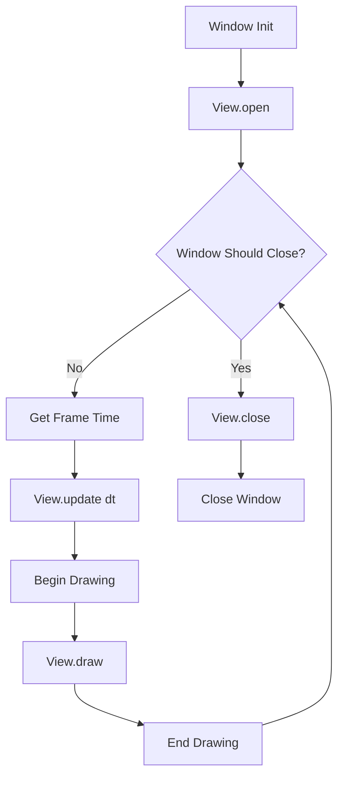

The Crimsonland rewrite uses a classic **update-then-render** game loop with deterministic simulation and presentation-phase separation.

## High-Level Flow



## Frame Pipeline

Each frame executes in three phases:

<Steps>
  <Step title="Input Collection">
    Gather keyboard, mouse, gamepad inputs and build `PlayerInput` frames.
  </Step>
  <Step title="Deterministic Update">
    Run `WorldState.step()` with normalized inputs to advance simulation.
  </Step>
  <Step title="Presentation">
    Apply audio/visual effects from deterministic presentation commands.
  </Step>
  <Step title="Render">
    Draw terrain, sprites, UI, and effects to screen.
  </Step>
</Steps>

## View Protocol

The rewrite uses a simple `View` protocol for game screens:

```python src/grim/view.py
class View(Protocol):
    """Pluggable view for raylib window."""
    
    def open(self) -> None:
        """Called once after window init."""
        ...
    
    def update(self, dt: float) -> None:
        """Called each frame before drawing."""
        ...
    
    def draw(self) -> None:
        """Called each frame inside BeginDrawing/EndDrawing."""
        ...
    
    def close(self) -> None:
        """Called once before window closes."""
        ...
```

## Main Loop Implementation

The core loop lives in `src/grim/app.py`:

```python src/grim/app.py
def run_view(
    view: View,
    *,
    width: int = 1280,
    height: int = 720,
    fps: int = 60,
) -> None:
    """Run a Raylib window with a pluggable view."""
    rl.init_window(width, height, "Crimsonland")
    rl.set_target_fps(fps)
    
    view.open()
    
    while not rl.window_should_close():
        dt = rl.get_frame_time()
        
        # Update phase
        view.update(dt)
        
        # Render phase
        rl.begin_drawing()
        view.draw()
        rl.end_drawing()
    
    view.close()
    rl.close_window()
```

## Gameplay Mode Loop

Game modes implement the `View` protocol. Example from Survival:

```python src/crimson/modes/survival_mode.py
class SurvivalMode:
    def __init__(self, world: GameWorld):
        self.world = world
        self.session = SurvivalDeterministicSession(...)
    
    def update(self, dt: float) -> None:
        # Collect inputs from all players
        inputs = self.collect_player_inputs()
        
        # Run deterministic step
        result = self.session.step_tick(
            dt=dt,
            inputs=inputs,
        )
        
        # Apply presentation commands
        self.apply_presentation(result)
        
        # Update elapsed time
        self.elapsed_ms += result.dt_sim * 1000.0
    
    def draw(self) -> None:
        # Draw world (terrain, sprites)
        self.world.renderer.draw()
        
        # Draw HUD overlay
        draw_hud(self.world.state, self.world.players)
        
        # Draw perk selection UI if pending
        if self.world.state.perk_selection.pending_count > 0:
            draw_perk_menu(...)
```

## Deterministic Step

The core deterministic tick runs in `src/crimson/sim/world_state.py`:

```python src/crimson/sim/world_state.py
class WorldState:
    def step(
        self,
        dt: float,
        *,
        inputs: list[PlayerInput],
        # ... other params
    ) -> WorldEvents:
        """Run one deterministic simulation tick."""
        
        # 1. Apply world-dt hooks (Reflex Boost time scaling)
        dt_sim = self.apply_world_dt_steps(dt)
        
        # 2. Run perk effects (Evil Eyes, Doctor, Jinxed, etc.)
        perks_update_effects(self.state, self.players, ...)
        
        # 3. Update player movement, aim, firing, reload
        for player, input in zip(self.players, inputs):
            player_update(player, self.state, dt_sim, input)
        
        # 4. Update projectiles (movement, hit detection)
        self.state.projectiles.update(...)
        
        # 5. Update creatures (AI, movement, damage)
        deaths = self.creatures.update(...)
        
        # 6. Update bonuses (pickup detection, timers)
        pickups = bonus_update(self.state, self.players, ...)
        
        # 7. Handle player deaths (Final Revenge, etc.)
        self.apply_player_death_hooks()
        
        # 8. Update effects (camera shake, FX timers)
        self.state.effects.update(dt_sim)
        
        return WorldEvents(
            hits=hits,
            deaths=deaths,
            pickups=pickups,
            sfx=sfx_events,
        )
```

<Note>
  All RNG draws happen inside `WorldState.step()` using `state.rng`. This ensures deterministic replay.
</Note>

## Presentation Phase

After the deterministic step, presentation commands are planned:

```python src/crimson/sim/step_pipeline.py
def run_deterministic_step(
    world: WorldState,
    timing: FrameTiming,
    inputs: list[PlayerInput],
    ...
) -> DeterministicStepResult:
    # 1. Run deterministic simulation
    events = world.step(timing.dt_sim, inputs=inputs, ...)
    
    # 2. Plan presentation commands (SFX, music triggers)
    presentation = apply_world_presentation_step(
        state=world.state,
        players=world.players,
        hits=events.hits,
        deaths=events.deaths,
        pickups=events.pickups,
        ...
    )
    
    # 3. Compute command hash for replay verification
    command_hash = presentation_commands_hash(presentation)
    
    return DeterministicStepResult(
        dt_sim=timing.dt_sim,
        events=events,
        presentation=presentation,
        command_hash=command_hash,
    )
```

Presentation commands include:

- **SFX keys** — Ordered list of sound effects to play
- **Music triggers** — Game tune start (first hit in Survival)
- **Visual effects** — Decals, rings, particles

<Warning>
  Presentation commands must be deterministic. Use `state.rng` for any randomization, not `random.random()`.
</Warning>

## Frame Timing

Frame timing is handled by `FrameTiming` struct:

```python src/crimson/sim/timing.py
class FrameTiming(msgspec.Struct):
    dt_sim: float           # Simulation delta (after Reflex Boost)
    dt_player_local: float  # Player input delta (unscaled)
    
    @classmethod
    def build(
        cls,
        dt: float,
        *,
        reflex_boost_timer: float,
        time_scale_active: bool,
    ) -> FrameTiming:
        # Convert to float32 for parity
        dt_f32 = f32(dt)
        
        # Apply Reflex Boost time scaling
        if time_scale_active and reflex_boost_timer > 0:
            scale = time_scale_reflex_boost_factor(
                reflex_boost_timer=reflex_boost_timer,
                time_scale_active=True,
            )
            dt_sim = f32(dt_f32 * scale)
        else:
            dt_sim = dt_f32
        
        return cls(
            dt_sim=dt_sim,
            dt_player_local=dt_f32,
        )
```

### Reflex Boost Time Scaling

When Reflex Boost is active, time slows down:

```python
def time_scale_reflex_boost_factor(
    reflex_boost_timer: float,
    time_scale_active: bool,
) -> float:
    if not time_scale_active:
        return 1.0
    
    reflex_f32 = f32(reflex_boost_timer)
    time_scale_factor = f32(0.3)  # 30% speed
    
    # Fade in over first second
    if reflex_f32 < 1.0:
        time_scale_factor = f32((1.0 - reflex_f32) * 0.7 + 0.3)
    
    return time_scale_factor
```

## Update/Render Separation

The rewrite strictly separates update and render:

<Tabs>
  <Tab title="Update Phase">
    - Collect inputs
    - Run deterministic simulation
    - Plan presentation commands
    - Update timers and counters
    - **No raylib drawing calls**
  </Tab>
  <Tab title="Render Phase">
    - Draw terrain
    - Draw sprites (players, creatures, projectiles)
    - Draw effects (decals, particles)
    - Draw UI (HUD, menus)
    - **No gameplay state changes**
  </Tab>
</Tabs>

<Check>
  This separation enables headless replay verification and ensures rendering bugs don't affect simulation.
</Check>

## Screenshot Support

The game loop includes built-in screenshot capture:

```python
# Press F12 to capture
if rl.is_key_pressed(rl.KeyboardKey.KEY_F12):
    rl.take_screenshot(f"screenshots/{index:05d}.png")
```

## FPS Control

The loop respects the target FPS via raylib:

```python
rl.set_target_fps(60)  # Target 60 FPS
dt = rl.get_frame_time()  # Actual delta time
```

For replay verification, use fixed timestep:

```python
TICK_RATE = 60
FIXED_DT = 1.0 / TICK_RATE  # 0.0166... seconds
```

## Next Steps

<CardGroup cols={2}>
  <Card title="Deterministic Pipeline" icon="gears" href="/rewrite/architecture/deterministic-pipeline">
    Deep dive into the step contract
  </Card>
  <Card title="Gameplay System" icon="crosshairs" href="/rewrite/systems/gameplay">
    Explore gameplay mechanics
  </Card>
  <Card title="Rendering System" icon="palette" href="/rewrite/systems/rendering">
    Learn about rendering
  </Card>
  <Card title="Replay Module" icon="circle-play" href="/rewrite/modules/replay">
    Understand replay recording
  </Card>
</CardGroup>
